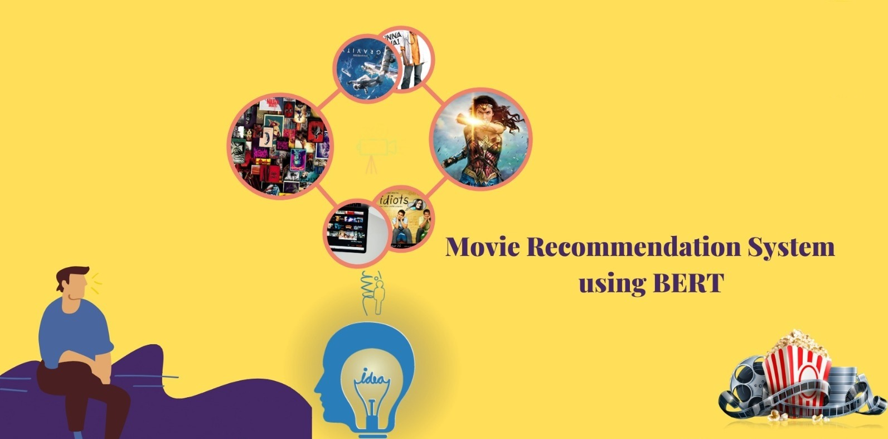
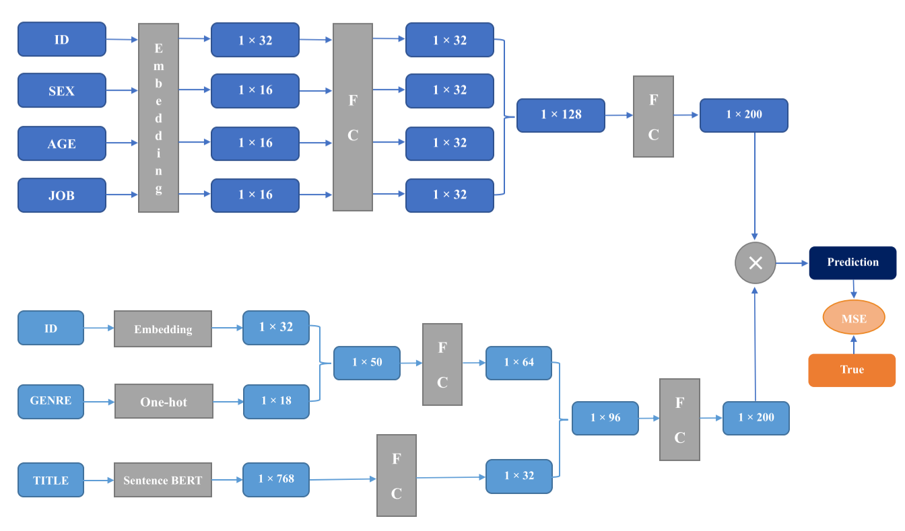

# AI-Driven Movie Recommendation System

## Overview

Welcome to the **AI-Driven Movie Recommendation System** project! This repository contains code, implementation, and insights for building 
a movie recommendation system using neural networks. The project aims to provide personalized movie recommendations based on user preferences 
and interactions.

## Table of Contents

- [Overview](#overview)
- [Project Details](#project-details)
- [Dataset](#dataset)
- [Data Preprocessing](#data-preprocessing)
- [Model Architecture](#model-architecture)
- [Training and Evaluation](#training-and-evaluation)
- [Recommendation Generation](#recommendation-generation)
- [License](#license)
- [Contact](#contact)

## Project Details

- **Motivation:** The project aims to create an AI-driven recommendation system that suggests movies tailored to users' preferences,
enhancing user experience and engagement.

- **Notebook:** The core analysis and modeling are documented in the Jupyter Notebook "main.ipynb". The notebook covers data preprocessing,
   model building, training, evaluation, and recommendation generation.

- **Language:** Python

## Dataset

- **Source:** The project uses a movie dataset containing information about movies and user interactions, such as ratings and viewing history.

## Data Preprocessing

- The dataset is loaded, cleaned, and preprocessed to prepare it for model training.

- User interactions are transformed into a suitable format for building the recommendation system.

## Model Architecture

- The recommendation system uses neural network architectures like embeddings and layers.

- Collaborative filtering techniques are utilized to capture user preferences and generate recommendations.

- ## Bert-Based
- 

## Training and Evaluation

- The model is trained on user interactions, aiming to predict user preferences for movies.

- Evaluation metrics, such as Mean Squared Error (MSE), assess the model's performance.

## Recommendation Generation

- The trained model is used to generate personalized movie recommendations for users.

- Recommendations are based on users' past interactions and preferences learned by the model.

## License

This project is licensed under the [MIT License](LICENSE).

## Contact

For questions or feedback, please contact [fatema.sorna@gmail.com].

